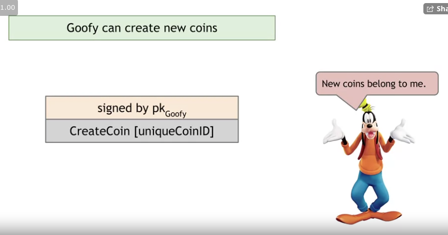
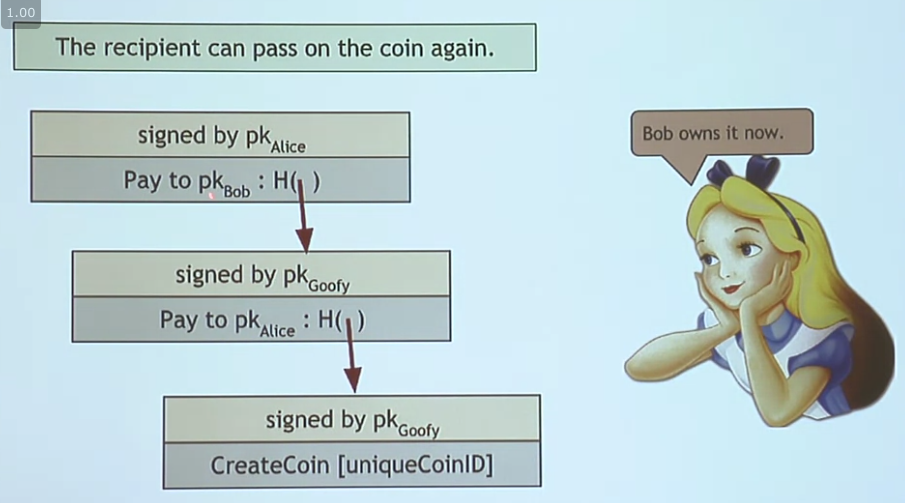
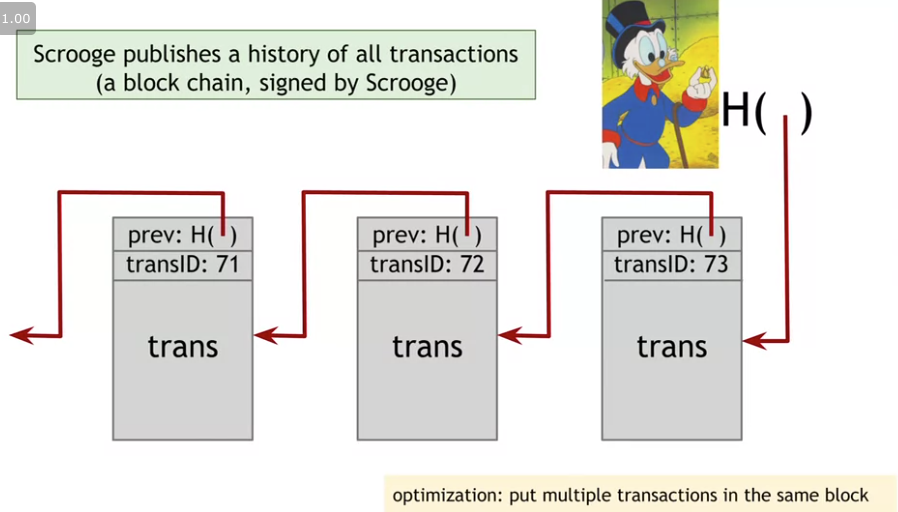
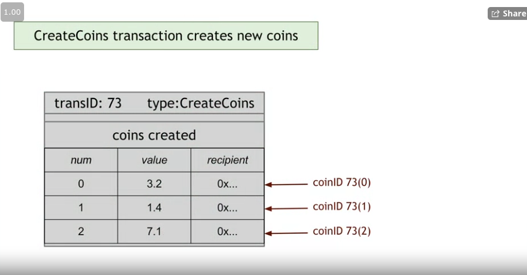
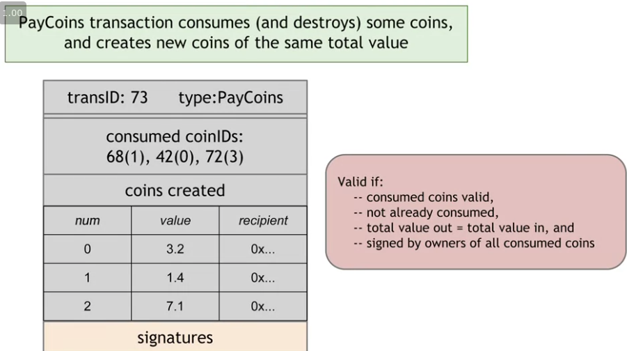

# goofy coin 
  * rules 
    * goofy can make a new coin whenever he wants
    
    * whoever owns a coin can pass on their coin by signing a statement that says "pass this coin that I own to this other person"
  * transactions
    
    * The person who is paying someone else needs to sign the coin in order for it to be a valid transaction
    * * you can verify validity by following the chain of transactions 
  * double spending attack
    

# scrooge coin
  * 
  * the history will be published and will allow us to protect against double spending
  * everyone will be able to detect the double spending because the history will be published 

  * transaction type: createCoins
    

  * the transaction from above shows a transaction that creates a bunch of coins.

* transaction type: PayCoins
  

  * consumes (and destroys) some coins, and creates new coins of the same total value

  * the transaction must be signed by all of the consumed coins

10 coins => value of 3.0 

transfer coins to friends with value of 5.0 

total value of 30.0 with 10 coins worth 3.0 
